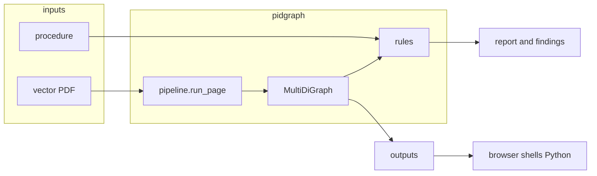

# Architecture

A run takes a vector PDF of a piping and instrumentation diagram and a standard operating procedure. The drawing is turned into a NetworkX graph on disk. A small rules engine compares that graph to the procedure and writes a report. The browser, when you use it, shells out to Python; it is not a second server.

Install and the command line live in the root [`README`](../README.md). Citations live in [`assumptions.md`](assumptions.md). Rejected options live in [`tradeoffs.md`](tradeoffs.md).

## How a drawing becomes a graph

Only born-digital vector PDFs are extracted. A raster or scanned page raises an error rather than becoming an empty graph. Discovery in `pidgraph/paths.py` looks for `.pdf` only.

Per page, `run_page` in `pidgraph/pipeline.py` does this:

1. **Probe** (`ingest/probe.py`) asks what the page actually offers: vectors, a text layer, dash arrays, raster. A page can have good geometry and a useless text layer, so later stages pick a strategy from this answer rather than forking the whole pipeline into “vector” versus “raster”.
2. **Calibrate** (`extract/calibrate.py`) recovers the drawing’s own module. Every later threshold is a multiple of that unit, not a point size tuned on the sample sheet.
3. **Primitives** (`extract/primitives.py`) put the marks into one drawing-space coordinate system. Promoting a mark to lettering is a hypothesis, not a commitment.
4. **Frame** (`extract/frame.py`) separates the title block and furniture from the content.
5. **Lines** (`extract/lines.py`) recover conductors before text. A simulated dash is glyph-sized; only the chaining test can tell a dash run from a label.
6. **Text** (`extract/text.py`) builds regions from the glyph marks the lines did not consume.
7. **Recognise** (`recognise/`) reads stroke lettering first. Regions the matcher refuses may go to Tesseract. If rendering or the engine fails, labels stay unread and extraction continues.
8. **Symbols** (`extract/symbols.py`) run after unread promotion is reverted, so letter-shaped brackets stay symbols instead of vanishing into the text pool.
9. **Assemble** (`extract/assemble.py` `build()`) binds line ends to symbol ports. Crossing lines are not joined. Tag attachment (`extract/attach.py`) runs last, inside `build()`, and only writes attributes onto nodes and edges that already exist.

Tags are parsed with the ISA-5.1 grammar in `pidgraph/standards/`. Classes are DEXPI names where we know them. Unknown symbols stay `unknown`.

## What the graph holds

The plant graph is a NetworkX `MultiDiGraph`, written as node-link JSON by `extract/export.py`. There is no GraphML writer and no second `graph.json` schema.

| | Attributes |
|---|---|
| Node | `kind`, `dexpi_class`, `label`, `tag_canonical`, `page`, `confidence`, and the box `x0,y0,x1,y1` |
| Edge | `kind`, `style`, `evidence`, `confidence`, `line_ids`; `line_number` when a line label bound |

Edge direction is assembly order, not process flow. Fluid type (gas versus liquid) is not a first-class attribute; a line label may mention it. An empty graph that reports success is a pipeline bug: a stage that cannot produce a usable result raises rather than returning empty.

## Procedure and findings

`crossref/sop.py` loads the procedure. Word files are Office Open XML. PDFs use PyMuPDF tables when a grid is present. Plain text and Markdown are paragraphs only. Legacy `.doc` is discovered by the path probe and then rejected at load, with a message to save as `.docx` or PDF.

The checks in `crossref/checks.py` are a rules engine: tags named in both documents, design-limit rows, intra-drawing consistency. Design-limit nameplates are not read from the drawing (`limits` is empty in the command line). A language model may phrase an answer; it does not decide a finding. The sample procedure agrees with the sample drawing everywhere, so correctness is shown by fault injection in `tests/test_crossref.py`, not by waiting for a real discrepancy.

## Where the code lives

| Role | Path |
|---|---|
| Command line | `pidgraph/cli.py` — `doctor`, `probe`, `extract`, `check`, `recognise`, `benchmark`, `migrate` |
| Pipeline | `pidgraph/pipeline.py` |
| Graph write | `pidgraph/extract/export.py` |
| Procedure and findings | `pidgraph/crossref/` |
| Local files and optional Postgres | `pidgraph/store/` |
| Synthetic precision and recall | `pidgraph/benchmark/` |
| Ask tools | `pidgraph/agent/` — `find_tag`, `describe`, `neighbors`, `walk` |
| Review UI | `web/` |
| Sample inputs | `data/p&id/`, `data/sop/` |

## Review UI

From `web/`, `npm install` then `npm run dev`, then `http://localhost:3000`. There is no Python HTTP server. The Next.js routes spawn `python -m pidgraph.{library, cli extract, render, preview, agent}`.

| Route | What it runs |
|---|---|
| `/api/library` | `-m pidgraph.library` |
| `/api/extract` | `-m pidgraph.cli extract --pid` |
| `/api/render` | `-m pidgraph.render` |
| `/api/preview`, `/api/document` | `-m pidgraph.preview` |
| `/api/ask` | `-m pidgraph.agent` |
| `/api/snapshot` | Reads the node-link JSON, or the Supabase function when the public env vars are set |
| `/api/health` | Nothing; a liveness probe |

Selecting a drawing PDF extracts to `outputs/<sha256>/graph.nodelink.json`. Findings in file mode always come from the root `outputs/findings.jsonl`, which is written by `check`, not by the UI extract. That means the panel can show findings from a different run than the graph on screen. The Supabase `graph_snapshot` path is used only when `NEXT_PUBLIC_SUPABASE_URL` and `NEXT_PUBLIC_SUPABASE_ANON_KEY` are set and no hash is passed; then graph and findings come from the same call.

## Operations

The command-line image is pinned to `python:3.13-slim-bookworm`. Unpinned `python:3.13-slim` currently aliases Debian trixie, which renamed a large set of library packages.

Compose `pipeline` runs that image. Compose `web` is a Node image with no Python and no mounts for `data/` or `outputs/`, so extraction and previews only work from `npm run dev` against a local virtual environment.

`pidgraph migrate --apply` applies `supabase/migrations/` when `DATABASE_URL` is set. `check` still writes the JSON files either way.
