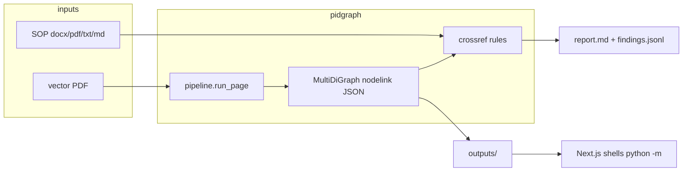

# Architecture

Install and CLI: [`../README.md`](../README.md). Citations: [`assumptions.md`](assumptions.md). Rejected options: [`tradeoffs.md`](tradeoffs.md).

## Pipeline

`pidgraph/pipeline.py` `run_page()`. Born-digital vector PDFs only; a raster page raises `ExtractionError`. Discovery (`pidgraph/paths.py`) accepts `.pdf` for drawings.

| Step | Module | What |
|---|---|---|
| 1 Probe | `ingest/probe.py` | Vectors, text layer, dash arrays, raster |
| 2 Calibrate | `extract/calibrate.py` | Recover module `U`. Later thresholds are `scale.u(k)`, not point sizes |
| 3 Primitives | `extract/primitives.py` | Marks in drawing space; lettering promotion is a hypothesis |
| 4 Frame | `extract/frame.py` | Title block / furniture vs content |
| 5 Lines | `extract/lines.py` | Conductors before text: simulated dashes are glyph-sized; chaining is the test |
| 6 Text | `extract/text.py` | Regions from remaining glyph marks |
| 7 Recognise | `recognise/` | Vector stroke match first; unread regions optionally go to Tesseract. Failure degrades to unread labels, never aborts |
| 8 Symbols | `extract/symbols.py` | After unread promotion is reverted — letter-shaped brackets stay symbols |
| 9 Assemble | `extract/assemble.py` `build()` | Port binding + endpoint proximity. Crossing lines are not joined. `attach.py` runs last inside `build()`: tags and line numbers onto existing nodes/edges only |

ISA-5.1 grammar: `pidgraph/standards/`. Unknown symbols stay `dexpi_class=unknown`.

## Graph contract

NetworkX `MultiDiGraph`, written as node-link JSON (`extract/export.py`). No GraphML, no `graph.json`.

| | Attributes |
|---|---|
| Node | `kind`, `dexpi_class`, `label`, `tag_canonical`, `page`, `confidence`, `x0,y0,x1,y1` |
| Edge | `kind`, `style`, `evidence`, `confidence`, `line_ids`; `line_number` when a line label bound |

Edge direction is **assembly order**, not process flow. Fluid type is not a first-class attribute. An empty graph that reports success is a pipeline bug: stages raise rather than return empty.

## SOP / findings

`crossref/sop.py` `load()`:

| Suffix | Loader |
|---|---|
| `.docx` | Office Open XML |
| `.pdf` | PyMuPDF tables when a grid is present |
| `.txt`, `.md` | Paragraphs only |
| `.doc` | Discovered by `paths.py`, rejected at load |

`crossref/checks.py` is a rules engine: tags in both documents, design-limit rows, intra-drawing consistency. Design-limit nameplates are not read from the drawing (`limits = {}` in `cli.py`). A model may phrase an answer; it does not decide a finding. The sample SOP agrees with the sample drawing; correctness is `tests/test_crossref.py` fault injection.

## Package map

| Role | Path |
|---|---|
| CLI | `pidgraph/cli.py` — `doctor`, `probe`, `extract`, `check`, `recognise`, `benchmark`, `migrate` |
| Pipeline | `pidgraph/pipeline.py` |
| Graph write | `pidgraph/extract/export.py` |
| SOP + findings | `pidgraph/crossref/` |
| Local files / optional Postgres | `pidgraph/store/` |
| Synthetic P/R | `pidgraph/benchmark/` |
| Ask tools | `pidgraph/agent/` — `find_tag`, `describe`, `neighbors`, `walk` |
| Review UI | `web/` |
| Sample inputs | `data/p&id/`, `data/sop/` |

## UI

Next.js at `http://localhost:3000` (`web/`: `npm install && npm run dev`). No Python HTTP server. Routes shell `python -m pidgraph.{library, cli extract, render, preview, agent}`.

| Route | Python |
|---|---|
| `/api/library` | `-m pidgraph.library` |
| `/api/extract` | `-m pidgraph.cli extract --pid` |
| `/api/render` | `-m pidgraph.render` |
| `/api/preview`, `/api/document` | `-m pidgraph.preview` |
| `/api/ask` | `-m pidgraph.agent` |
| `/api/snapshot` | reads JSON (or Supabase RPC) |
| `/api/health` | none |

File snapshot: `outputs/<sha256>/graph.nodelink.json` plus **root** `outputs/findings.jsonl` (written by `check`, not by UI `extract`). Supabase `graph_snapshot` only when `NEXT_PUBLIC_SUPABASE_URL` and `NEXT_PUBLIC_SUPABASE_ANON_KEY` are set **and** no `hash` query is passed.

## Ops

- CLI image: `python:3.13-slim-bookworm` (pin; unpinned `python:3.13-slim` aliases trixie).
- Compose `pipeline` runs the CLI. Compose `web` is Node-only: no Python, no `data/`/`outputs/` mounts — extraction and previews need `npm run dev` against a local `.venv`.
- `pidgraph migrate --apply` applies `supabase/migrations/` when `DATABASE_URL` is set. `check` still writes the JSON files.
