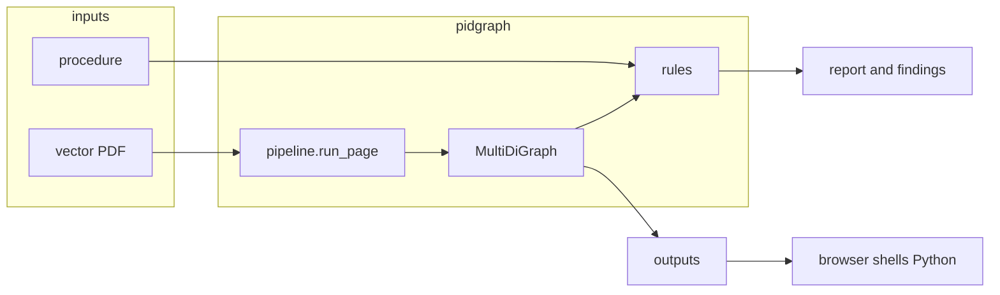

# Architecture

A run takes two documents that are supposed to describe the same plant: a vector PDF of a piping and instrumentation diagram, and a standard operating procedure. The drawing is turned into a NetworkX graph on disk. A small rules engine compares that graph to the procedure and writes a report. The browser, when used, shells out to Python; it is not a second server.

Install and the command line live in the root [`README`](../README.md). What extraction and findings stand on lives in [`assumptions.md`](assumptions.md). Rejected options live in [`tradeoffs.md`](tradeoffs.md). Docker, Debian, the pooler, and `migrate --apply` live in Operations below, not in the register.

## How a drawing becomes a graph

A piping and instrumentation diagram is a scaled diagram in a published language, not a photograph. ISA-5.1 names the instruments. ISO 81714-1 and ISA clause 6 size the symbols as ratios to a per-drawing *module* (ISA: measurement unit; ISO: M). DEXPI names the classes. The PDF is the particular plot CAD produced of that language.

Only born-digital vector PDFs are extracted. A raster or scanned page raises an error rather than becoming an empty graph. Discovery in `pidgraph/paths.py` looks for `.pdf` only.

Per page, `run_page` in `pidgraph/pipeline.py` proceeds as follows.

1. **Probe** (`ingest/probe.py`). Real pages mix good geometry with a useless text layer. The sample drawing has excellent vectors and about sixty-nine characters of logo footer. The probe records what the page actually offers — vectors, a text layer, dash arrays, raster — and later stages pick a strategy from that inventory. The pipeline does not fork into “vector” versus “raster” on the strength of the text layer alone.
2. **Calibrate** (`extract/calibrate.py`). ISA Table 6.1 puts the instrument bubble at 7 (optionally 8) measurement units. Table 6.3 puts a signal line at 0.2 and a process line at 0.4. ISO 81714-1 ties line width to M/10; ISO 10628-1 assigns widths by object class against M = 2.5 mm. Calibration recovers the page’s module from those published ratios, mainly the narrow stroke and the dominant bubble diameter. Text height is measured and used as a sanity gate only: there is no published bubble-to-text ratio, and on a stroke font the marks are a mixture of partial glyphs and several sizes. Every later threshold is a multiple of the recovered module, not a point size tuned on the sample sheet. If the estimators disagree, this step fails rather than silently fitting `data/`.
3. **Primitives** (`extract/primitives.py`). Marks are put into one drawing-space coordinate system. Promoting a mark to lettering is a hypothesis, not a commitment: a letter-shaped bracket must be allowed to become a symbol again.
4. **Frame** (`extract/frame.py`). The title block, border, logo, and revision table are separated from the plant. On page 0 of the sample, the company logo is roughly 45 percent of the paths. Title-block words also look like tags; they must not bind to equipment.
5. **Lines** (`extract/lines.py`). Process pipes and instrument signals are recovered before text. Many CAD exporters never set a PDF dash array — the sample’s 18 319 paths all report `[] 0` — and instead draw dashes as runs of short strokes. Those strokes are glyph-sized. Only the chaining test can tell a dashed signal from a label. Printed digits are periodic too, so a chain that is short or sparse is dissolved and its marks returned to the text pool. Crossing lines are not junctions: without a jump, they pass over one another.
6. **Text** (`extract/text.py`). Regions are built from the glyph marks the lines did not consume. Rows are found by interval banding, with orientation chosen per row, so a lone vertical label on a horizontal page is not voted into the floor.
7. **Recognise** (`recognise/`). On these sheets the lettering is AutoCAD SHX: each glyph is pen paths already in the file, with no `/Contents` string to read. Raster OCR plateaued around 72 percent on hairline stroke fonts; matching the strokes themselves is the primary reader. Tesseract is the fallback when that matcher refuses a region. If rendering or the engine fails, labels stay unread and extraction continues. Recognition is an enrichment, not a gate.
8. **Symbols** (`extract/symbols.py`). Unread promotion is reverted first, so letter-shaped brackets stay symbols instead of vanishing into the text pool. The instrument circle is then a measurement: once the module is known, a bubble is about seven modules across, which is what ISA Table 6.1 states. Unknown shapes stay `unknown`.
9. **Assemble** (`extract/assemble.py` `build()`). Line ends bind to symbol ports, or to each other when two endpoints coincide. Crossing lines are not joined. A fabricated edge is structurally identical to a real pipe later, so the cheaper error is to miss a join. Tag attachment (`extract/attach.py`) runs last, inside `build()`, and only writes attributes onto nodes and edges that already exist. An instrument’s identity is often two stacked rows inside the bubble — function letters over the loop number — which only parse once they are joined.

Tags are parsed with the ISA-5.1 grammar in `pidgraph/standards/`. The letter table is the Kimray guide’s 1984 table, with the 2009 Safety Instrumented System modifier `Z` overlaid so an SIS loop is not classified as an ordinary position loop. Classes are DEXPI 1.4 names where a class is known. Unknown symbols stay `unknown`.

## What the graph holds

The plant graph is a NetworkX `MultiDiGraph`, written as node-link JSON by `extract/export.py`. There is no GraphML writer and no second `graph.json` schema. DEXPI 1.4 serialises as Proteus; serialisation remains behind the class names rather than emitting Proteus XML, because DEXPI 2.0 replaces Proteus with “DEXPI XML”.

| | Attributes |
|---|---|
| Node | `kind`, `dexpi_class`, `label`, `tag_canonical`, `page`, `confidence`, and the box `x0,y0,x1,y1` |
| Edge | `kind`, `style`, `evidence`, `confidence`, `line_ids`; `line_number` when a line label bound |

Edge direction is assembly order, not process flow. Fluid type (gas versus liquid) is not a first-class attribute; a line label may mention it. An empty graph that reports success is a pipeline bug: a stage that cannot produce a usable result raises rather than returning empty.

A node is only as trustworthy as its weakest input: labelled-node confidence is the minimum of geometry and read. Absence-based findings (a procedure tag not recovered on the drawing) are capped, because that may be an extraction gap rather than a defect in the document.

## Procedure and findings

`crossref/sop.py` loads the procedure. Word files are Office Open XML. PDFs use PyMuPDF tables when a grid is present. Plain text and Markdown are paragraphs only. Legacy `.doc` is discovered by the path probe and then rejected at load, with a message to save as `.docx` or PDF.

The checks in `crossref/checks.py` are a rules engine: tags named in both documents, design-limit rows, intra-drawing consistency. Design-limit nameplates are not read from the drawing (`limits` is empty in the command line), because a page usually holds more than one vessel and a stray “300 psig” next to the wrong one is a worse error than an unresolved comparison. A language model may phrase an answer; it does not decide a finding.

The sample procedure agrees with the sample drawing everywhere. That is the legitimate full-agreement case, not a missing test. Correctness of the rules is shown by fault injection in `tests/test_crossref.py`.

## Where the code lives

| Role | Path |
|---|---|
| Command line | `pidgraph/cli.py` — `doctor`, `probe`, `extract`, `check`, `recognise`, `benchmark`, `migrate` |
| Pipeline | `pidgraph/pipeline.py` |
| Graph write | `pidgraph/extract/export.py` |
| ISA letter table and tag grammar | `pidgraph/standards/` |
| Procedure and findings | `pidgraph/crossref/` |
| Local files and optional Postgres | `pidgraph/store/` |
| Synthetic precision and recall | `pidgraph/benchmark/` |
| Ask tools | `pidgraph/agent/` — `find_tag`, `describe`, `neighbors`, `walk` |
| Review UI | `web/` |
| Sample inputs | `data/pid/`, `data/sop/` |

## Review UI

From `web/`, `npm install` then `npm run dev`, then `http://localhost:3000`. There is no Python HTTP server. The Next.js routes spawn `python -m pidgraph.{library, cli extract, render, preview, agent}`.

| Route | What it runs |
|---|---|
| `/api/library` | `-m pidgraph.library` |
| `/api/extract` | `-m pidgraph.cli extract --pid` |
| `/api/render` | `-m pidgraph.render` |
| `/api/preview`, `/api/document` | `-m pidgraph.preview` |
| `/api/ask` | `-m pidgraph.agent` |
| `/api/snapshot` | Reads the node-link JSON, or the Supabase function when the public env vars are set |
| `/api/health` | Nothing; a liveness probe |

Selecting a drawing PDF extracts to `outputs/<sha256>/graph.nodelink.json`. Findings in file mode always come from the root `outputs/findings.jsonl`, which is written by `check`, not by the UI extract. The panel can therefore show findings from a different run than the graph on screen. The Supabase `graph_snapshot` path is used only when `NEXT_PUBLIC_SUPABASE_URL` and `NEXT_PUBLIC_SUPABASE_ANON_KEY` are set and no hash is passed; then graph and findings come from the same call.

## Operations

The command-line image is pinned to `python:3.13-slim-bookworm`. Unpinned `python:3.13-slim` currently aliases Debian trixie, which renamed a large set of library packages (`libglib2.0-0` became `libglib2.0-0t64`; `libgl1-mesa-glx` disappeared). These package facts belong here rather than in the assumptions register.

Compose `pipeline` runs that image. Compose `web` is a Node image with no Python and no mounts for `data/` or `outputs/`, so extraction and previews only work from `npm run dev` against a local virtual environment.

`pidgraph migrate --apply` applies `supabase/migrations/` when `DATABASE_URL` is set. `check` still writes the JSON files either way.
